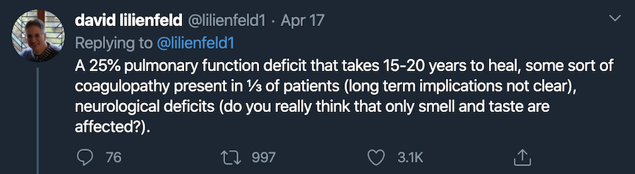
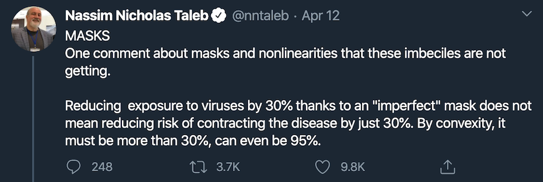

safeCOVID App helps to reopen up the economy without giving into involuntary mass surveillance.

We are solving widespread adoption of privacy preserving contact tracing by involving the community.

Let's open up The World again
-------

COVID is the defining challenge of our lifetime. 

One that central authorities failed miserably at. We can hope that they will do the right thing, eventually. But hope is not a strategy.

We need to reopen the society, but not lose our rights in the process. Once we lose freedom, we won't get it back easily.

Sadly the narrative is that we need to cede more control to governments and corporations... the same ones who are still not adopting the scientific evidence on wearing masks and providing widespread tests. 

We do not need more top-down approaches, more surveillance. And even with privacy preserving approaches proposed by Google and Apple, we do not have a way to get mass adoption.

Without mass adoption, those approaches are not effective. The exemplar, Singapore's TraceTogether app currently has an adoption rate of less than 15%. They need to get 60% adoption to be effective.

I'm sure you can see what will happen next in name of public safety. E.g Singapore did try to surveil everyone after they said they wouldn't. They reverted only after Kevin Chu decompiled the code and [checked](https://splira.com/2020-03-28/), as covered by [Bloomberg here](https://www.bloomberg.com/news/articles/2020-04-15/hackers-have-some-of-the-best-ideas-in-war-against-coronavirus)

India asks for personal identifying information in the app, which is useful, but not strictly needed. Both these examples ask for location information, which again, is useful, but not needed. To their credit, Apple and Google's approach does not require location tracking.

> “They who would give up an essential liberty for temporary security, deserve neither liberty or security.” -Benjamin Franklin

There is another way.

Instead of top-down, a better way to build an antifragile society is bottoms-up, a.k.a Talebian Localism.

We need to hold each other accountable and grow trust from the ground up.

How does safeCOVID work?
----------

You are a responsible person and trust yourself. You trust your family to do the right thing as well... 

But what about your neighbours? The person at the checkout counter where you picked up a pack of gum? Your parents? Cousins?

safeCOVID teaches you a new set of skills, these are - creating a mask cheaply, wearing it properly, and washing hands.

Once you have gone through those and shared with folks living with you, you are safeCOVID level 1.

When you meet someone in person, you must insist that they show you their safeCOVID level. 

If they cannot, or are not wearing a mask, you must assume that they are unsafe and politely practice social distancing. The current recommendation is 6ft, or 2m. 

Please do not harass them, but encourage them to 'get on your level'.

Every time you meet someone, your level takes a hit, but not if you shared your level first.

The longer you stay together, the more similar your level gets.

The longer you stay at home, the higher your level gets.

If you meet someone who travels and meets a lot of people, your level suffers.

If you enable location alerts in the app your level will go up by 1. Location alerts do not send any data to the server, but remind you to put on a mask when you start a new journey. This can be verified by looking at the source code.

We also encourage good behavior by letting people take a photo of themselves in the mask on the phone, to see if it works properly. Again, this photo is not stored and privacy preserving ML can detect gaps of air on the skin.

If you enable contact tracing, your level will go up to 3. Most people will enable this as insurance. It is a voluntary opt-in.

If you must share a meal with someone, aka, take off masks, you should check that they have the *same* level before you do. Please also check if the local hospitals will have enough beds in two weeks, before you take such a risk.

Anyone who meets you should get on your level, otherwise they endanger, not just you, but everyone you met for the last 2-3 weeks.

Oh, and your level, stays on your phone, except with those with whom you deliberately share.

We solve this, by holding each other accountable, together.

How do you share your level?
--------------
Every day, your app randomly assigns you one of 256 avatars. When you bring up safeCOVID, you will see avatars of people around you. 

You hold up your phones and visually show each other your avatar for the day.

Then, in the App, choose them to decode each other's scores.

In case you couldn't guess, these coupled with keys from the server are your AES encryption keys.

We need to rotate server side keys every hour to make sure no one is hacking the system. The emojis enable future enhancements like having the app on smart watch, or a brooch on the mask that you press.

This could be done with QR codes too but then we would then need to use the camera, and yes, add friction.

Credit for the original idea

What happens if you get alerted, or are feeling sick?
---------------
Being responsible, you would have been sharing safeCOVID levels. In two weeks from now, if the neighbourhood grocer exhibits symptoms, you will get an alert. 

They will remain anonymous, unless they want to share some identifying information.

There are two flavors of these alerts.

One is to exercise caution, where they are feeling sick and waiting for a test. And so, you must assume you have it, and self-quarantine.

In some societies, it might be safe to share some identifying information. The one who sends the signal can choose to send absolutely nothing, or one of these -
- Phone number of the person responsible to bring food to the patient.
- Asking for donations to help them quarantine.
- Simply asking folk to check on them.

We will notify the people they have met most often to check on them, as they are most likely to notice someone they know has gone missing. And help them.

We also rely on these existing networks to tell us if the person is COVID positive, not the health authorities. 

> You are defined by the company you keep

We still need contact tracing, but it does not have to be as surgical. The tradeoff is that we have less identifying information, and more people will be flagged as false positives.

We know that self-isolation does not work well for families as they are not able to keep the same standard of hygiene as a hospital. See [this](https://jamanetwork.com/journals/jama/fullarticle/2764658?guestAccessKey=913ec584-d2cf-4175-b583-b60e9cb15412&utm_source=twitter&utm_medium=social_jama&utm_term=3265409166&utm_campaign=article_alert&linkId=86260014)

In places where governments did not separate the patient on first symptoms, the families got infected at a high rate. So we have to assume entire families need help. So we give up a little bit of accuracy (like tracking children) in exchange for more anonymity.

If your local government is indeed competent, you should call them and ask for instructions, so that you do not infect your family.

As it stands, there aren't enough tests in most countries for everyone. The answer isn't to try to curb the number of people who can have tests. Rather easier 'smell' and 'taste' markers at home, and not send people to the hospital lines where they can catch more infections. We plan to work with experts and roll these tests into the app so they can be done at home.

We hope that the local governments will rise to the challenge, and make safeCOVID obsolete.

If you do get COVID and have a test that your most frequent familiars can verify, and survive, you might be on the highest level. However we have to wait for the science to be clearer on that. Besides mortality, COVID reduces lung capacity, perhaps, permanently.

We pledge to delete all data (random tokens) once this is behind us. There are also better ways to obfuscate the data, where no one organization has access to all of it, as noted in [this paper](https://arxiv.org/abs/2003.11511).

What is different from other approaches
---------------
Apple and Google have proposed a privacy preserving way to track every human interaction and coordinate with the local health authorities on tests. But have left adoption as an exercise to the reader. Coordination with health authorities is also not straightforward in many countries. And in some, dangerous.

As you can see the main goal of the app isn't to track every interaction (e.g. we do not want to track hand washing, children, or even wearing masks), but to educate. When we meet someone, what we are really sharing is their level of hygiene.

This also leaves room for those who are do not want to improve their hygiene. As long as they advertise their level to you beforehand you can decide if the risk is worth it for you.

This encourages wider adoption. Even those who do not trust their government can get on the app. But it does increase (from 60%) how many people would need to have the app to be effective. With better education, and more awareness, we will close that gap.

Algorithm
--------
At the basic level, every time we meet someone, we get downvoted with their score, and when we stay home, recover. People who meet a lot of others will correctly be downvoted more times as they are getting exposure multiple times. These are the hubs in the network.

We are basically talking about a pagerank backrub update.

When we share the uuids, we can also share the hashed score, and update each other. This does not require any central authority to calculate the score.

The update is `my_score += your_score * lambda`

As you can see, the more risky the person you spend time with, the more risk you pass on to others.

The MVP does send these scores to the server, because I am one person with one phone and this is how I could prototype to make sure scoring works correctly. Once this is figured out, we MUST turn it off and let it live on the phones, not centrally.

Anyone who controls the scoring will control all our futures. And so it must be auditable and stay in this codebase.

A global vision
-------------
With COVID apps in each country, you will likely be asked to install them when the borders reopen. This open-source way is a great way to get everyone on the same level without sacrificing our freedoms. Left to making their own closed apps, countries aren't likely give up tracking once they have it.

> “To rob the public, it is necessary to deceive them. To deceive them, it is necessary to persuade them that they are robbed for their own advantage, and to induce them to accept in exchange for their property, imaginary services, and often worse.” ― Bastiat

Every country can check and audit the level. They can commit code if they think of a better way in a transparent way.

UX
----
India is home to 13 national languages with a literacy rate of 74%. In Sub-Saharan Africa, literacy in many countries is still below 60%. This means we need to communicate using videos and emojis.

You have seen the screenshots shared here to show the principle.

We also pick the video in the localised language. These videos are public and on youtube. This incidentally, is also how we market the app besides word of mouth. We cannot track installs via pixels because you know, that would defeat the purpose.

Further enhancements
-------------
There can be privacy preserving signature of person's movement via gyrosope, to make sure they don't give their phone to someone else to boost their level. Look at Apple's privacy preserving faceID work for a great way to do this.

We could theoretically have people take each other's photos to verify they are wearing masks, but that increases friction, and hence, adoption. Also, I'm not sure if formal verification is that much better than reminders and education so folks will do this by default.

We can also give discounts to those who wear their score on their mask publicly.

Finally, if someone is higher risk, we can, as a community, help them get the right PPE. After all, protecting these hubs in the network, protects us all. An example would be getting N95 masks for healthcare workers... then, maybe for that grocery bagging person next.

Societies are built on bottoms up trust, top-down has to be earned.

FAQ
-------
Q. Do we have to wear masks even if I don't have any symptoms?

A. When you meet someone else, yes. See [this](https://www.fast.ai/2020/04/13/masks-summary/) excellent resource by Jeremy howard and Rachel Thomas, for details. Nearly half the infections have been via people who did not show any symptoms. 

> 'My mask protects you, your mask protects me'

And of course, more by [Taleb](https://twitter.com/nntaleb/status/1249302327158333442)

Q. Do kids have to wear masks?

A. Yes, sadly, for now. You child might not get sick but can still pass it on to you, or your parents.

Q. Do I have to wear a mask in my car?

A. If you are only ever alone in that car, or with people of the same level, you do not have to. We do not need forced surveillance like [this](https://arstechnica.com/cars/2020/04/covid-19-means-truckers-need-facemask-aware-driver-monitoring-systems/). 

Corollary, if you get into any new confined space (car, taxi, office) where people stay for a long time, you should wear a mask at all times because you can no longer assume safety.

Q. Why not just wait for herd immunity?

A. [Just No](https://www.ncbi.nlm.nih.gov/pmc/articles/PMC3506030/). Credit [@CT_Bergstrom](https://twitter.com/CT_Bergstrom) Also, we have enough data from enough countries and provinces in China to have a good answer on this. If the science changes, we will update. But for now, please stop makig this argument.

Q. Do we still need to bluetooth scan in the background?

A. No. Because when people share their levels, we can scan then. However, given the Google/Apple proposal, this is a moot point.

Q. Why masks and not lockdowns?

A. Lockdowns are a rough tool to get the R0 under and give hospitals time to adjust. But masks and social distancing keep R0 under control for a longer term. Besides, with better hygine we might also decrease risk of some other diseases.

Q. What about folk who do not have a smartphone?

A. You can set a great example by politely asking for their safeCOVID level, and wearing a mask yourself. This does not mean they will go out and get a phone. But that they will be aware of good hygine and get safer. saveCOVID is a mechanism for education. If most of the population is practicing good hygine, we do not need safeCOVID.

Q. Are you sure you got everything right?

A. I build this in two weeks to avoid a surveillance future for myself and my kids. I am occasionally gifted, but I am certain I did not get every detail right. Now is your chance to constructively amend the proposals here by creating a github issue. Feel free to add pull requests, or tweet/DM at me at [@analyticsaurabh](https://twitter.com/analyticsaurabh). Or borrow ideas wholesale.

I am putting forth a clear a vision of the World we need to create. And working code to help.

Q. What are your qualifications?

A. As you might have noticed, I'm not big on credentials. Since you asked, I have double bachelors degrees (not double major) in CS and Maths, on full scholarship. Since 2000, I have been a professional programmer, data scientist, ML engineer and everything in between. Previously, I founded data science at Barnes & Nobles and Rent The Runway. I wrote all ML for Rent The Runway from scratch and was first one to make fashion ML recommendations. And again, as the sole founder for Virevol ai, invented a new way to shop. No, I am not a public health official or virology expert of any sort. You should probably judge the idea on its merit and make your own conclusions. If you don't, you're missing the point of all this.

Q. Does this mean I should not do what my government says?

A. There are too many countries in the World for me to give you an answer here. The short answer is, do this as a global citizen. But please evaluate ideas on their own merit, not relying on people who claim to be an expert in everything. Those experts might appear on TV, or as government. If their advice helps, or you install one more app, you should consider doing it.

Guiding priciple for all advice right now: It's better to err on the side of more caution when we do not know. Vaccinate when we have a solution.

Q. What about abuse because of X?

A. We cannot solve all of society's ills with this. Right now, the Titanic is sinking and we need to teach people how to swim, quickly. We can talk about the music later.

***Trust people who you see everyday.***

Current Status
---------
I was sure someone would do this, and I waited. But got increasingly frustrated to see that no one was talking about adoption, just copying Singapore's idea. So I built it in two weeks, thanks to existing work by MIT group, Polidea, Vitor Pamplona, and countless others.

The MVP runs and works.

However, Apple has rejected this app as virevol ai is not a health authority. Google has still not reviewed the app.

> "your app must be published under a seller and company name of a recognized institution. If you have developed this app on behalf of such an institution, please advise your client to add you to the development team of their Apple Developer account."

While I understand their reasons, I propose that any open source project should be allowed.

Google Youtube is also banning all videos that go against WHO's recommendations, which have been wrong at a lot of critical steps, and are still wrong about masks. Their current advice is still, in mid-April, to only wear masks if you have symptoms, despite the evidence.

We need more diverse ideas to drive up adoption, not fewer. Esp when Google and Apple did not propose any ideas of their own.

I am now donating this project and the ideas herein, to any organization that Apple and Google approve of.. yes, we still do need some authorities :)

This MVP did what it was supposed to do. I tested that a contact tracing app with a community first approach could be launched. If the idea has merit, it will go on with or without this project.

If you need help and further clarity, please open a PR and I will help. If you are an organization interested in adopting it with the principles described, please reach out.

However, please act quickly. India is a ticking time bomb with cases doubling every 10 days, with less than 0.7 beds per 1000. Apple and Google's solution v1 rolls out mid-May, by then, India will likely have in excess of 100k cases. And that might be too late.

We must optimize for speed.

My parents are both doctors in India. My wife's family is in France. I live in NYC with two adorable kids. So yes, my motivation for putting this proposal forth is so that we can build a society we want, Worldwide.

If this virus has taught us anything, its that we are all very, very connected.

Let's get through this together.

-----
proposal by virevol ai
